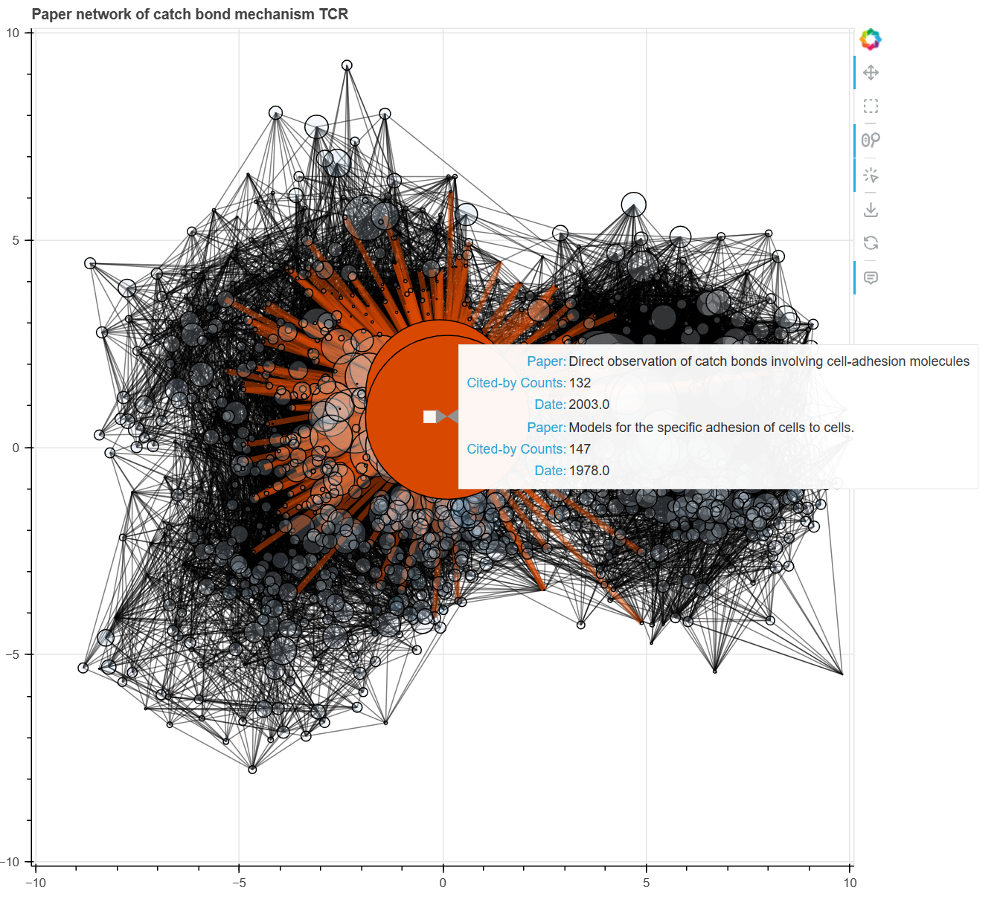

# Paper Network Builder
This is a tool to build a network of papers from search keywords to get a better understanding of the research landscape.

It builds on top of the [Semantic Scholar API](https://api.semanticscholar.org/), the [NetworkX](https://networkx.github.io/), and the [Bokeh](https://bokeh.org/) library.

For an interactive example, see [here](fig/catch%20bond%20mechanism%20TCR_cited_by.html).


## Usage
First clone the repository
```bash
git clone https://github.com/hsianktin/paper_network_builder.git
```
Then create a virtual environment
```bash
python -m venv venv
```
To install the dependencies, run
```bash
pip install -r requirements.txt
```
Then you can run the app with
```bash
python scholarly_search.py query
```
where `query` is the keywords you want to search for.
